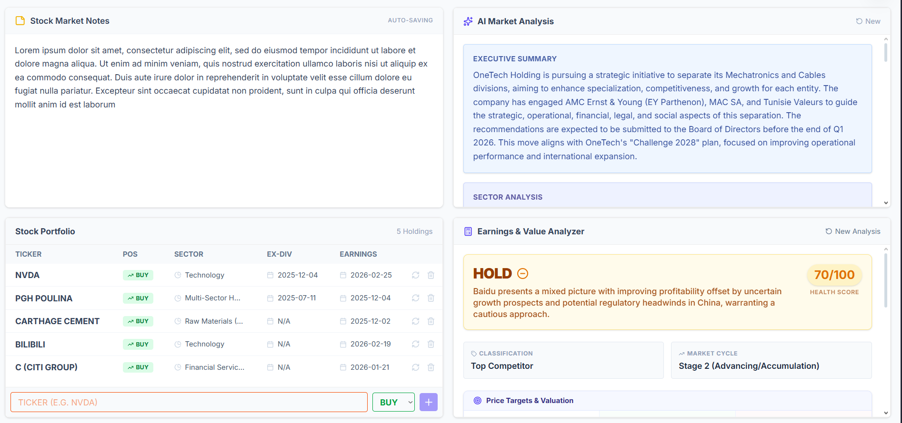
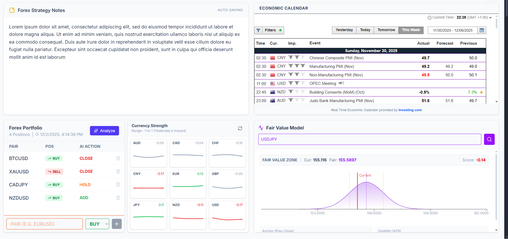
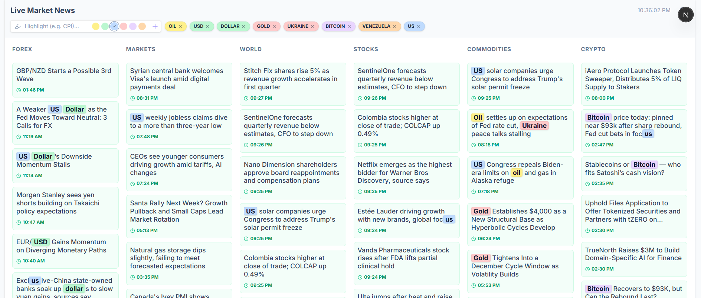
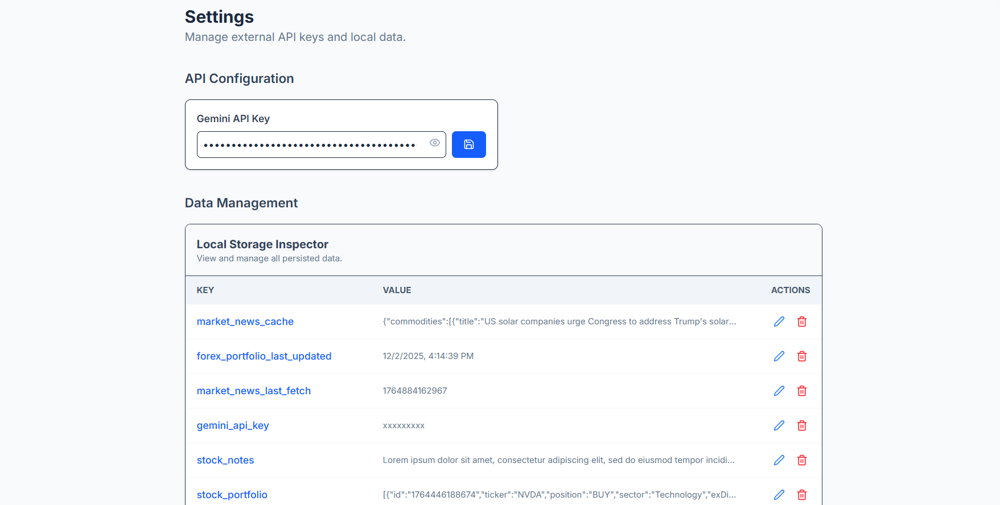

# 📈 Financial Insight Dashboard

A powerful, **Serverless Client-Side SPA** for financial analytics, powered by **Next.js** and **Google Gemini AI**. 

This project operates entirely in the browser without a traditional backend database. It persists data via `localStorage`, fetches real-time market data through CORS proxies, and leverages AI for deep financial analysis.

## ✨ Key Features

### 🌍 Forex Dashboard
*   **Currency Strength Meter:** Real-time relative strength calculation by scraping ForexFactory calendar events via proxy. Includes intelligent "Backfill" logic to calculate missing historical data.
*   **Fair Value Gap:** Mathematical modeling using Yahoo Finance API data + Gaussian Bell Curve logic.
*   **AI Portfolio Tracker:** Manage positions with Gemini-powered "Hold/Accumulate/Close" recommendations.

### 🏢 Stocks Dashboard
*   **Smart Portfolio:** Add tickers (e.g., "NVDA") and watch the app automatically enrich data (Sector, Ex-Dividend, Earnings Date) using AI.
*   **Market News:** Real-time RSS feeds (Investing.com) with **keyword highlighting** and color-coding.
*   **Earnings Analyzer:** Paste raw financial text (Income Statement, Balance Sheet) to generate a professional "Buy/Sell/Hold" thesis.
*   **Article Deconstructor:** Paste news articles to get a structured executive summary, sentiment analysis, and trading scenarios.

### ⚙️ Architecture
*   **Zero Backend:** No Node.js server, no SQL/NoSQL database.
*   **Persistence:** Custom `useLocalStorage` hook acts as the database.
*   **AI Integration:** Direct Client-to-API calls to Google Gemini 2.0 Flash (supports Google Search Grounding).
*   **Networking:** Bypasses CORS restrictions using `corsproxy.io` and `rss2json`.

---

## 📸 Screenshots

| **Stocks Dashboard** | **Forex Dashboard** |
|:---:|:---:|
|  |  |
| *Portfolio Tracking & Article Analysis* | *Strength Meter & Fair Value Calc* |

| **Market News** | **Settings** |
|:---:|:---:|
|  |  |
| *RSS Feeds with Keyword Highlighting* | *API Key Management* |

---

## 🛠️ Tech Stack

*   **Framework:** Next.js 14 (App Router)
*   **Language:** TypeScript
*   **Styling:** Tailwind CSS + Lucide React Icons
*   **AI Provider:** Google Gemini API (Generative Language Client)
*   **State Management:** React Hooks + LocalStorage
*   **Data Fetching:** Native `fetch` with CORS Proxies

---

## 🚀 Getting Started

### Prerequisites
*   Node.js 18+ installed.
*   A free [Google Gemini API Key](https://aistudio.google.com/).

### Installation

1.  **Clone the repository:**
    ```bash
    git clone https://github.com/OussemaKhemiri/financial-insight-dashboard.git
    cd financial-insight-dashboard
    ```

2.  **Install dependencies:**
    ```bash
    npm install
    # or
    yarn install
    ```

3.  **Run the development server:**
    ```bash
    npm run dev
    ```

4.  **Open the app:**
    Visit `http://localhost:3000` in your browser.

### Configuration
Since there is no backend, you **do not** need a `.env` file for the API key.
1.  Navigate to the **Settings** tab in the UI.
2.  Paste your **Gemini API Key**.
3.  The key is saved securely in your browser's `localStorage`.

---

## 📂 Project Structure

```bash
src/
├── app/                  # Next.js App Router pages
├── components/           
│   ├── forex/            # Forex specific components (StrengthChart, Portfolio)
│   ├── stocks/           # Stocks components (PortfolioTable, EarningsAnalysis)
│   └── shared/           # Reusable UI (MarketNewsTable, Sidebar)
├── hooks/                
│   ├── useLocalStorage.ts # The "Database" logic
│   ├── useForexData.ts    # Scraping & Backfill logic
│   ├── useGemini.ts       # AI communication hooks
│   └── ...
└── lib/                  
    ├── gemini.ts         # Prompts & API calls
    ├── scraping.ts       # HTML parsing logic
    └── storage.ts        # Safe storage utilities
```

## ⚠️ Disclaimer

This application is for **informational and educational purposes only**. The analysis provided by the AI and the calculations (Fair Value, Strength Meter) should not be considered as professional financial advice. Always do your own research before trading.

